## Contact

```
    Name : Chrisnico Alexander Hutapea
    Email : hutapeniko@gmail.com
```

## Logika Test

### How to run?

```
change directory : cd Tes_Logika
====
Answer 1 : node answer1.js
Answer 2 : node answer2.js
Answer 3 : node answer3.js
Answer 4 : node answer4.js
Answer 5 : node answer5.js
```

### Output

`Soal 1 : `
<br/>
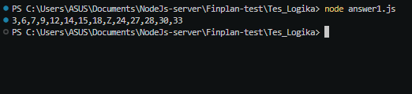
<br/>
<br/>
`Soal 2 : `
<br/>
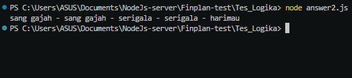
<br/>
<br/>
`Soal 3 : `
<br/>
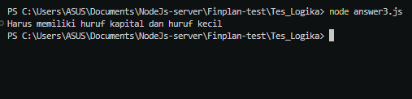
<br/>
<br/>
`Soal 4 : `
<br/>
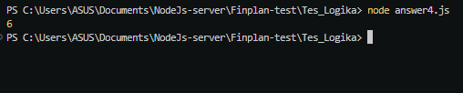
<br/>
<br/>
`Soal 5 : `
<br/>
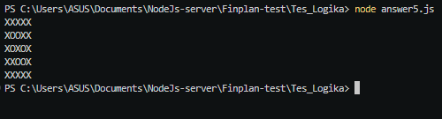
<br/>

## Backend Test

### How to run?

```
Open Mysql
====
Answer 1 : jalankan semua query
Answer 2 : jalankan semua query
Answer 3 : jalankan semua query
Answer 4 : jalankan semua query
```

### Output

`Soal 1 : `
<br/>
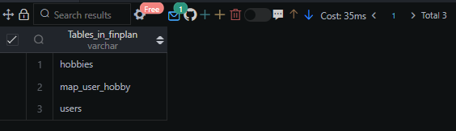
<br/>
<br/>
`Soal 2 : Filter Running data hobbies`
<br/>
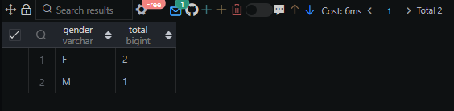
<br/>
<br/>
`Soal 2 : Filter Push Up data hobbies`
<br/>
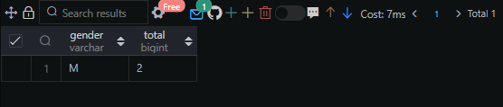
<br/>
<br/>
`Soal 2 : Filter Skipping data hobbies`
<br/>
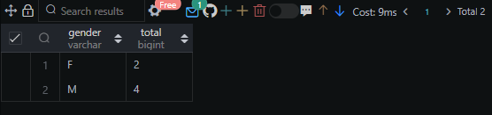
<br/>
<br/>
`Soal 3 : `
<br/>
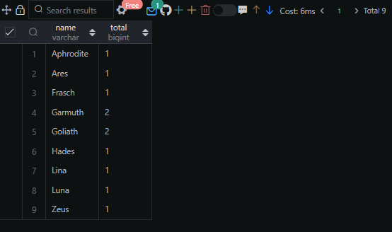
<br/>
<br/>
`Soal 4 : `
<br/>
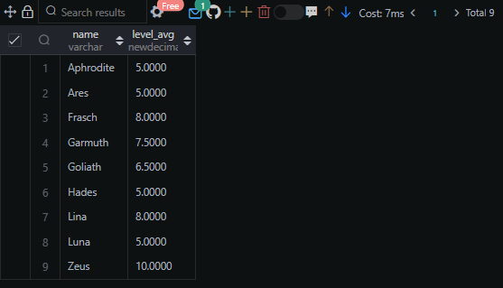
<br/>
